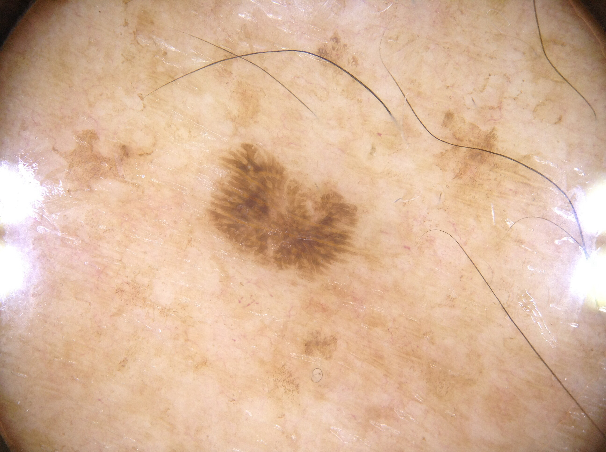

# TensorflowSwinUNet-Segmentation-Skin-Lesion (2023/08/06)
<h2>
1 TensorflowSwinUNet-Segmentation-Skin-Lesion 
</h2>
This is an experimental project for Image Segmentation of Skin-Lesion by using 
TensorflowSwinUNetModel,
which is a Tensorflow 2 implementation of
<a href="https://arxiv.org/pdf/2105.05537.pdf">
<b>Swin-Unet: Unet-like Pure Transformer for Medical Image Segmentation</b>
</a>.

In order to write the <a href="./TensorflowSwinUNet.py">TensorflowSwinUNet</a> Python class,
 we have used the Python code in the following web sites.

<pre>
1.keras-unet-collection
 https://github.com/yingkaisha/keras-unet-collection/tree/main/keras_unet_collection
</pre>

Please see also:

<pre>
2. U-Net: Convolutional Networks for Biomedical Image Segmentation
 https://arxiv.org/pdf/1505.04597.pdf
</pre>
<pre>
3.Swin-Unet: Unet-like Pure Transformer for Medical Image Segmentation
https://arxiv.org/pdf/2105.05537.pdf
</pre>

<pre>
4.Image-Segmentation-Skin-Lesion
https://github.com/sarah-antillia/Image-Segmentation-Skin-Lesion.git
</pre>

The image dataset used here has been taken from the following web site.

<pre>
ISIC Challenge Datasets 2017
https://challenge.isic-archive.com/data/
</pre>

<b>Citing 2017 datasets:</b>
<pre>
Codella N, Gutman D, Celebi ME, Helba B, Marchetti MA, Dusza S, Kalloo A, Liopyris K, Mishra N, Kittler H, Halpern A.
 "Skin Lesion Analysis Toward Melanoma Detection: A Challenge at the 2017 International Symposium on Biomedical Imaging (ISBI),
  Hosted by the International Skin Imaging Collaboration (ISIC)". arXiv: 1710.05006 [cs.CV]
</pre>
<b>License: CC-0</b> 
 
See also: 

<a href="https://paperswithcode.com/dataset/isic-2017-task-1">ISIC 2017 Task 1</a> 
<pre>
Introduced by Codella et al. in Skin Lesion Analysis Toward Melanoma Detection: 
A Challenge at the 2017 International Symposium on Biomedical Imaging (ISBI), 
Hosted by the International Skin Imaging Collaboration (ISIC)
</pre>
<pre>
The ISIC 2017 dataset was published by the International Skin Imaging Collaboration (ISIC) as a large-scale dataset 
of dermoscopy images. The Task 1 challenge dataset for lesion segmentation contains 2,000 images for training with 
ground truth segmentations (2000 binary mask images).
</pre>
 
<h2>
2. Install TensorflowSwinUNet-Segmentation-Skin-Lesion
</h2>
Please clone TensorflowSwinUNet-Segmentation-Skin-Lesion.git in a folder <b>c:\google</b>. 
<pre>
>git clone https://github.com/sarah-antillia/TensorflowSwinUNet-Segmentation-Skin-Lesion.git 
</pre>
You can see the following folder structure in your working folder. 

<pre>
TensorflowSwinUNet-Segmentation-Skin-Lesion
├─asset
└─projects
    └─-Skin-Lesion
        ├─eval
        ├─generator
        ├─mini_test
        │   ├─images
        │   └─masks
        ├─mini_test_output
        ├─mini_test_output_merged
        ├─models
        ├─Skin-Lesion
        │   ├─train
        │   │  ├─images
        │   │  └─masks
        │   └─valid
        │       ├─images
        │       └─masks
        ├─mini_test_output
        └─mini_test_output_merged
</pre>

<h2>
3 Prepare dataset
</h2>

<h3>
3.1 Download master dataset
</h3>
  Please download the original Test, Train, Valid image and mask dataset <b>ISIC Challenge Datasets 2017</b> from the following link 

<pre>
ISIC Challenge Datasets 2017
https://challenge.isic-archive.com/data/
</pre>

The dataset <b>ISIC-2017</b> has the following folder structure. 

<pre>
./ISIC-2017
├─ISIC-2017_Test_v2_Data
├─ISIC-2017_Test_v2_Part1_GroundTruth
├─ISIC-2017_Training_Data
├─ISIC-2017_Training_Part1_GroundTruth
├─ISIC-2017_Validation_Data
└─ISIC-2017_Validation_Part1_GroundTruth
</pre>
Image  *_Data folders contain jpg image files of various size from 1K to 4K, and mask dataset *_GroundTruth 
folders contain the segmention png files corresponding to the images in *_Data folders.

<h3>
3.2 Create image and mask dataset
</h3>
By using Python script <a href="./projects/Skin-Lesion/generator/ImageMaskDatasetGenerator.py">ImageMaskDatasetGenerator.py</a>,
 we have created <b>Skin-Lesion</b> dataset from the original jpg image files in <b>*_Data</b> folders and png mask files in 
 <b>*_GroundTruth</b> folders. 
The script performs the following image processings. 
<pre>
1 Create 256x256 square images from original image files.
2 Create 256x256 square mask  corresponding to the image files. 
3 Create rotated, flipped, and mirrored images and masks to augment the resized square images and masks.
</pre>

The created <b>Skin-Lesion</b> dataset has the following folder structure. 
<pre>
./Skin-Lesion
├─train
│  ├─images
│  └─masks
└─valid
    ├─images
    └─masks
</pre>
<b>train/images samples:</b> 

 
<b>train/masks samples:</b> 

 

<h2>
4 Train TensorflowSwinUNet Model
</h2>
 We have trained Skin-Lesion TensorflowSwinUNet Model by using the following
 <b>train_eval_infer.config</b> file.  
Please move to ./projects/Skin-Lesion directory, and run the following bat file. 
<pre>
>1.train.bat
</pre>
, which simply runs the following command. 
<pre>
>python ../../TensorflowSwinUNetTrainer.py ./train_eval_infer.config
</pre>
, where train_eval_infer.config is the following.
<pre>
; train_eval_infer.config
; Skin-Lesion for TensorflowSwinUNet
; 2023/08/06 antillia.com 

[model]
;filter_num_begin = 128
filter_num_begin = 16
; number of channels in the first downsampling block; it is also the number of embedded dimensions

;depth = 4
depth = 6
; the depth of SwinUNET; depth=4 means three down/upsampling levels and a bottom level 

;stack_num_down = 2
stack_num_down = 3
; number of Swin Transformers per downsampling level

;stack_num_up = 2
stack_num_up = 3
; number of Swin Transformers per upsampling level

patch_size = (4, 4)  
; Extract 4-by-4 patches from the input image. Height and width of the patch must be equal.  

;num_heads = [4, 8, 8, 8]   
num_heads = [4, 4, 8, 8, 8, 8]   
;number of attention heads per down/upsampling level

;window_size = [4, 2, 2, 2] 
window_size = [4, 4, 2, 2, 2, 2] 
;the size of attention window per down/upsampling level

;num_mlp = 512   
num_mlp = 256
; number of MLP nodes within the Transformer

shift_window=True          
;Apply window shifting, i.e., Swin-MSA

image_width    = 256
image_height   = 256
image_channels = 3
num_classes    = 1
; unused 
base_filters   = 16
base_kernels   = (5,5)
num_layers     = 7

dropout_rate   = 0.07
learning_rate  = 0.0001
clipvalue      = 0.5

; unused 
dilation       = (2,2)

loss           = "iou_loss"
metrics        = ["iou_coef"]
show_summary   = False

[train]
epochs        = 100
batch_size    = 2
patience      = 10
metrics       = ["iou_coef", "val_iou_coef"]
model_dir     = "./models"
save_waits_only = True
eval_dir      = "./eval"
image_datapath = "./Skin-Lesion/train/images"
mask_datapath  = "./Skin-Lesion/train/masks"
create_backup  = True

[eval]
image_datapath = "./Skin-Lesion/valid/images"
mask_datapath  = "./Skin-Lesion/valid/masks"
output_dir     = "./eval_output"

[infer] 
;images_dir = "./Skin-Lesion/test/images"
images_dir = "./mini_test/images"
output_dir = "./mini_test_output"
merged_dir = "./mini_test_output_merged"

[mask]
blur      = True
binarize  = True
threshold = 50
</pre>

The training process has just been stopped at epoch 43 by an early-stopping callback as shown below.  
 
 
 
<b>Train metrics line graph</b>: 
 
 
<b>Train losses line graph</b>: 
 

<h2>
5 Evaluation
</h2>
 We have evaluated prediction accuracy of our Pretrained Skin-Lesion Model by using <b>valid</b> dataset. 
Please move to ./projects/Skin-Lesion/ directory, and run the following bat file. 
<pre>
>2.evalute.bat
</pre>
, which simply runs the following command. 
<pre>
>python ../../TensorflowSwinUNetEvaluator.py ./train_eval_infer.config
</pre>
The evaluation result is the following. 
 
 
 

<h2>
6 Inference 
</h2>
We have also tried to infer the segmented lesion for 
<pre>
images_dir    = "./mini_test/images" 
</pre> dataset defined in <b>train_eval_infer.config</b>,
 by using our Pretrained Skin-Region UNet Model. 
The mini_test dataset has just been created by using <a href="./projects/Skin-Lesion/generator/create_mini_test.py">
create_mini_test.py</a> from the original ISIC Test dataset.
<pre>

./ISIC-2017
├─ISIC-2017_Test_v2_Data
└─ISIC-2017_Test_v2_Part1_GroundTruth
</pre>
The Test Data folder contains very large images, from 3K to 6.6K in width. 

Please move to ./projects/Skin-Lesion/ directory, and run the following bat file. 
<pre>
>3.infer.bat
</pre>
, which simply runs the following command. 
<pre>
>python ../../TensorflowSwinUNetInferencer.py ./train_eval_infer.config
</pre>

<b><a href="./projects/Skin-Lesion/mini_test/images">Mini test input images</a> </b> 
 
 
<b><a href="./projects/Skin-Lesion/mini_test/masks">Mini test ground truth mask</a> </b> 
 
 

<b><a href="./projects/Skin-Lesion/mini_test_output/">Inferred images </a>test output</b> 
 
 
 

<b><a href="./projects/Skin-Lesion/mini_test_output_merged">Inferred merged images (blended test/images with 
inferred images)</a></b> 
  

<b>Some enlarged input images and inferred merged images</b> 
<table>
<tr>
<td>Input ISIC_0012223.jpg</td><td>Inferred-merged ISIC_0012223.jpg</td>
</tr>
<tr>
<td></td>
<td></td>
</tr>

<tr>
<td>Input ISIC_0012903.jpg</td><td>Inferred-merged ISIC_0012903.jpg</td>
</tr>
<tr>
<td></td>
<td></td>
</tr>

<tr>
<td>Input ISIC_0013948.jpg</td><td>Inferred-merged ISIC_0013948.jpg</td>
</tr>
<tr>
<td></td>
<td></td>
</tr>
<tr>
<td>Input ISIC_0014600.jpg</td><td>Inferred-merged ISIC_0014600.jpg</td>
</tr>
<tr>
<td></td>
<td></td>
</tr>

<tr>
<td>Input ISIC_0014693.jpg</td><td>Inferred-merged ISIC_0014693.jpg</td>
</tr>
<tr>
<td></td>
<td></td>
</tr>

</table>

 
<h3>
References
</h3>
<b>1. ISIC 2017 - Skin Lesion Analysis Towards Melanoma Detection</b> 
Matt Berseth 
<pre>
https://arxiv.org/ftp/arxiv/papers/1703/1703.00523.pdf
</pre>

<b>2. ISIC Challenge Datasets 2017</b> 
<pre>
https://challenge.isic-archive.com/data/
</pre>

<b>3. Skin Lesion Segmentation Using Deep Learning with Auxiliary Task</b> 
Lina LiuORCID,Ying Y. Tsui andMrinal Mandal 
<pre>
https://www.mdpi.com/2313-433X/7/4/67
</pre>

<b>4. Skin Lesion Segmentation from Dermoscopic Images Using Convolutional Neural Network</b> 
Kashan Zafar, Syed Omer Gilani, Asim Waris, Ali Ahmed, Mohsin Jamil,  
Muhammad Nasir Khan and Amer Sohail Kashif 
<pre>
https://www.mdpi.com/1424-8220/20/6/1601
</pre>

<b>5.Image-Segmentation-Skin-Lesion</b> 
Toshiyuki Arai @antillia.com 
<pre>
https://github.com/sarah-antillia/Image-Segmentation-Skin-Lesion.git
</pre>

